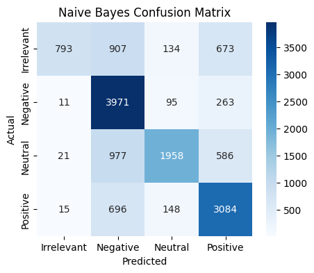
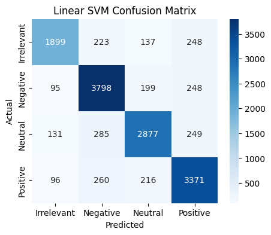
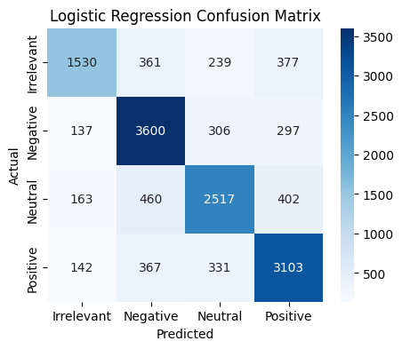
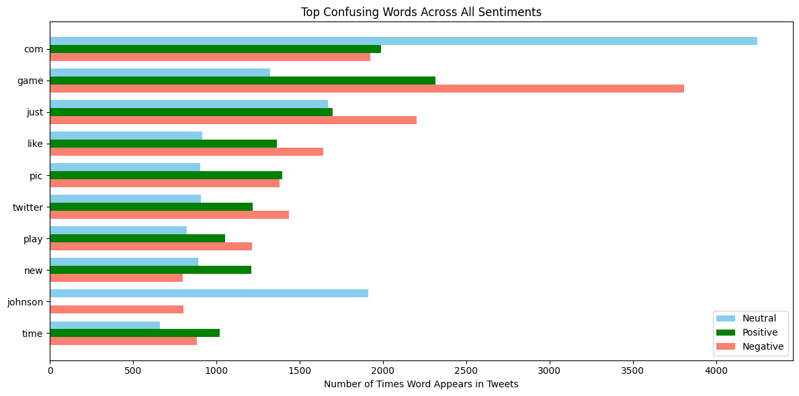

#  VIBE-LENZZ: Customer Sentiment Analysis at Scale

> **Turn raw customer feedback into actionable business insights.**

**VIBE-LENZZ** is a machine learning-powered application designed to analyze customer sentiments from textual feedback. It empowers organizations to classify comments, identify pain points, and make data-driven decisions to improve products and services.

---

##  Problem Statement

In the digital economy, a company’s financial health—spanning profits, sales, and market share—is inextricably linked to its online reputation. Public perception, driven by user reviews and comments, acts as a primary filter for potential customers before they commit to a purchase.

The reliance on this feedback loop creates a critical vulnerability: if negative sentiment outweighs the positive, the consequences are immediate and severe. Companies face **significant revenue loss**, **rapid customer churn**, and **long-term damage to brand reputation**.

Therefore, manual monitoring is no longer sufficient. **Sentiment analysis is imperative** for understanding the emotional drivers behind consumer behavior. **VIBE-LENZZ** addresses this critical need by analyzing customer feedback at scale, empowering organizations to move beyond simple observation and take data-driven actions.

---

## Motivation: The Cost of Ignoring Sentiment

Real-world examples illustrate the severe financial and reputational risks of failing to analyze customer feedback effectively.

#### Case Study 1: The Last of Us Part II (Naughty Dog)(im)
* ** The Challenge:** The game faced immediate, massive **"review bombing"** driven largely by ideological polarization rather than gameplay mechanics.
* ** The Failure:** Lacking nuanced sentiment tracking, the company failed to segment valid criticism from organized trolling. They missed early warning signs, leading to a defensive rather than strategic PR response.
* ** The Impact:** While initial sales were high, the uncontrolled negative narrative damaged **long-term sales potential** and eroded brand trust for future releases.
* ** The VIBE-LENZZ Solution:** Real-time sentiment dashboards would have allowed the team to identify specific grievance themes immediately, enabling a data-backed crisis management strategy.

#### Case Study 2: Fashion Nova
* ** The Challenge:** The brand faced a regulatory crisis, resulting in a **$4.2 million FTC fine** for suppressing negative reviews to artificially inflate ratings.
* ** The Failure:** Instead of analyzing feedback to fix issues, they hid comments under 4 stars. This blinded them to recurring pain points like **sizing inconsistencies** and **quality complaints**.
* ** The Impact:** The lack of transparency distorted public perception and resulted in a massive financial penalty and a loss of consumer trust.
* ** The VIBE-LENZZ Solution:** Automated analysis would have highlighted product flaws (e.g., sizing issues) for immediate improvement, turning negative feedback into a roadmap for better product design rather than a legal liability.

---

##  Overview & Features

**VIBE-LENZZ** is a Python-based Streamlit web application. It leverages **Support Vector Machines (SVM)** to process text from CSV or PDF uploads.

### Key Capabilities
* ** Sentiment Classification:** Categorizes feedback as Positive, Negative, Neutral, or Irrelevant.
* ** Actionable Insights:** Highlights top influential words and provides strategic recommendations.
* ** Interactive Visualizations:** Features dynamic pie charts and bar charts for real-time data exploration.
* ** PDF Reporting:** Exports analysis results into clean, formatted PDF reports for stakeholders.

---

##  How It Works

![VIBE-LENZZ System Workflow]

1.  **Input:** Users upload **CSV** (with a `Text` column) or **PDF** files containing raw customer comments.
2.  **Preprocessing:** The system automatically cleans data by normalizing text and removing noise (URLs, emojis, numbers, stopwords).
3.  **Vectorization:** **TF-IDF** transforms text into numerical features, weighing impactful words heavily to capture sentiment drivers.
4.  **Prediction:** An **SVM model** classifies the sentiment. SVM is chosen for its exceptional performance on high-dimensional text data and robust decision boundaries.
5.  **Visualization & Reporting:** The app generates charts and summarizes strengths/weaknesses into a downloadable PDF report.

---

##  Model Performance & Error Analysis

To ensure VIBE-LENZZ is reliable, we benchmarked three algorithms: **Naive Bayes**, **Logistic Regression**, and **Linear SVM**.

### 1. Model Comparison
We utilized Confusion Matrices to visualize decision boundaries:

| Naive Bayes | Linear SVM (Selected) | Logistic Regression |
| :---: | :---: | :---: |
|  |  |  |

**Why Linear SVM Won:**
* **Naive Bayes** struggled significantly, misclassifying a vast amount of 'Neutral' and 'Irrelevant' data as 'Negative' (likely due to data imbalance or feature independence assumptions).
* **Linear SVM** provided the most balanced accuracy. It correctly identified **2,877 Neutral cases** (the hardest class), significantly outperforming the others.

### 2. Deep Dive: The "Neutrality" Challenge
Despite SVM's strong performance, our error analysis reveals that the model occasionally confuses **Neutral** comments with **Positive** or **Negative** ones.

**The "Vocabulary Overlap" Problem:**
Our TF-IDF vectorizer assigns weight to words based on frequency. The error stems from the fact that "Neutral" comments often share high-frequency nouns and verbs with polarized comments, but lack the defining adjectives.



* **Evidence:** As seen in the chart above, high-frequency words like **"game"**, **"time"**, and **"just"** appear massively across **all three sentiments**.
* **The Model's Dilemma:** Because these words lack inherent polarity (they are context-dependent), the model struggles to distinguish a neutral statement (e.g., *"I played the game"*) from a negative one (e.g., *"This game is broken"*) based purely on word frequency.
* **Conclusion:** While SVM effectively maximizes the margin between clearly Positive and Negative sentiments, future iterations of VIBE-LENZZ would benefit from **Contextual Embeddings (BERT)** to better distinguish neutral statements from opinionated ones.

---

## 📂 Data Requirements

To ensure the model performs correctly, please ensure your data meets the following criteria:

* **CSV Files:** Must contain a column explicitly named **`Text`**.
* **PDF Files:** Can contain multiple pages; the system will automatically extract all text.

---

## 🔧 Installation & Usage

To run this project locally:

1.  **Clone the repository:**
    ```bash
    git clone [https://github.com/your-username/vibe-lenzz.git](https://github.com/your-username/vibe-lenzz.git)
    cd vibe-lenzz
    ```

2.  **Install dependencies:**
    ```bash
    pip install -r requirements.txt
    ```

3.  **Run the application:**
    ```bash
    streamlit run app.py
    ```

---

## 🤝 Contributing

Contributions are welcome! Please open an issue or submit a pull request for any improvements.

---

**Author:** [HENRICK REAGAN SARAI]
**Contact:** [LinkedIn ; Reagan Sarai]
