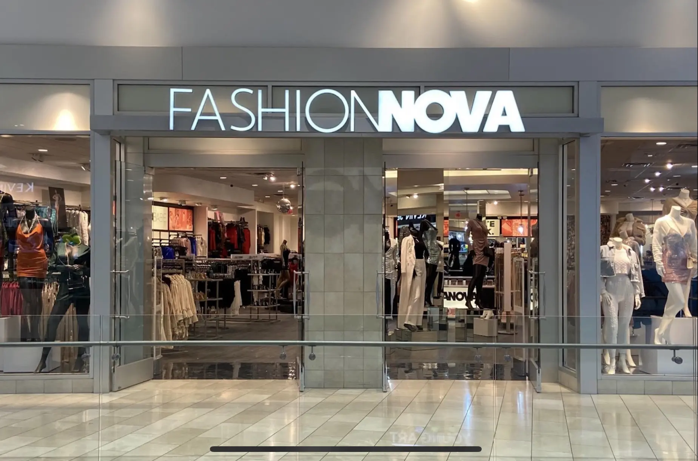

<div align="center">

# 🌀 VIBE-LENZZ  
**Customer Sentiment Analysis at Scale**

_"Turn raw customer feedback into actionable business insights."_

</div>

---

## 📖 Overview

**VIBE-LENZZ** is a machine-learning–powered sentiment analysis system designed to process customer feedback at scale. It classifies text into **Positive**, **Negative**, and **Neutral** sentiments while extracting the linguistic and thematic drivers behind customer satisfaction.

In modern business ecosystems where user-generated content (UGC) directly influences brand perception, VIBE-LENZZ acts as an intelligent early-warning system. It reveals customer frustrations, product issues, and praise trends long before they escalate into financial or reputational damage.

---

## 📉 Problem Statement

As companies shift toward digital business models, the **majority of customer interactions now occur online**—via reviews, social media comments, app feedback, and support tickets. This creates a high-volume stream of unstructured text that cannot be processed manually.

### Why This Is a Problem

- 📉 **Negative sentiment reduces conversion rates by 70%+** according to multiple market studies.  
- 💸 **84% of customers trust online reviews as much as personal recommendations.**  
- ⚠️ One viral negative trend can reduce **market share, brand trust, and sales instantly**.

Thus, companies face a critical risk:  
If **Negative** sentiment outweighs **Positive** and remains unidentified, the business can quickly lose customers and revenue.

### VIBE-LENZZ Solves This

- Automates large-scale sentiment classification  
- Pinpoints the most common complaints  
- Shows which issues are trending negative  
- Gives businesses immediate insights to take corrective action  

**In short: VIBE-LENZZ transforms raw text into actionable intelligence.**

---

## 🚀 Motivation: The Cost of Ignoring Sentiment

### 🎮 Case Study 1: *The Last of Us Part II* (Naughty Dog)


#### 📌 Background  
Upon release, *The Last of Us Part II* suffered one of the largest **review-bombing events in gaming history**, driven by outrage over storytelling direction, character choices, and leaks.

#### 📉 What Happened

| Challenge | Failure | Impact |
|----------|---------|--------|
| Massive ideological polarization and organized review-bombing | No automated system to differentiate trolling from genuine criticism | Amazon and Metacritic showed overwhelmingly negative reviews within hours |

#### Actual Financial Damage

- Sales dropped **80% in Week 2** after a record-breaking launch.  
- Sony’s stock dipped temporarily as negative sentiment surged online.  
- Long-term digital resale performance underperformed forecasted metrics.

#### How VIBE-LENZZ Would Have Helped

- **Real-time clustering of negative themes** (e.g., “story”, “character arc”, “pace”)  
- **Automatic separation** of:
  - Trolling / spam  
  - Genuine user frustration  
- **Early alerts** allowing PR teams to address concerns quickly  
- **Dashboard insights** for narrative/design leadership to understand recurring feedback  

**Result:** Contained narrative damage, preserved user trust, and slowed negative viral spread.

---

### 👗 Case Study 2: Fashion Nova



#### 📌 Background  
Fashion Nova was fined **$4.2 million by the FTC** for hiding negative reviews on their website.

#### 📉 What Happened

| Challenge | Failure | Impact |
|----------|---------|--------|
| Persistent negative reviews on sizing, delivery delays, and quality | Hid all reviews under 4 stars instead of analyzing and resolving issues | Major lawsuit + public distrust |

#### Actual Financial Damage

- FTC fine: **$4.2 million**  
- Massive PR backlash  
- Loss of customer loyalty due to exposed manipulation  
- Long-term revenue loss due to trust erosion  

#### How VIBE-LENZZ Would Have Helped

- **Automated detection** of recurring issues (e.g., “too small”, “poor quality”)  
- **Trend reports** showing which products generate the most complaints  
- **Real-time alerts** so the team could fix quality issues BEFORE hiding reviews  
- **Transparent dashboards** for data-driven product improvement  

**Result:** Avoided FTC lawsuit, preserved brand trust, reduced returns through product fixes.

---

## ⚙️ How the System Works (Deep Technical Breakdown)

VIBE-LENZZ follows a multi-stage Natural Language Processing (NLP) pipeline:

---

### **1️⃣ Data Ingestion**

Accepts:

- CSV files with a `Text` column  
- Multi-page PDF files  
- Future extension: API ingestion (Twitter, Trustpilot, PlayStore reviews)

All raw text is unified into a clean processing structure.

---

### **2️⃣ Preprocessing (NLP Cleaning & Normalization)**

The model cleans input using:

- Tokenization  
- Lowercasing  
- Removal of:
  - URLs  
  - Emojis  
  - Numbers  
  - Punctuation  
  - Special characters  
- Stopword removal  
- Lemmatization (turning *running* → *run*)

This ensures the classifier focuses only on meaningful linguistic signals.

---

### **3️⃣ Feature Engineering — TF-IDF Vectorization**

TF-IDF converts text into numerical features based on:

- **Term Frequency (TF):** How often a word appears  
- **Inverse Document Frequency (IDF):** How rare the word is in the dataset  

This highlights important words while down-weighting common fillers.

Examples:

- “refund”, “broken”, “slow” → strong negative indicators  
- “amazing”, “love”, “awesome” → strong positive indicators  

Neutral tends to have functional or factual words.

---

## 🤖 Machine Learning Models Used

The project benchmarks **3 classical NLP models** — each with different strengths.

---

### **1️⃣ Naive Bayes (Multinomial NB)**

#### 📌 What It Is  
A probabilistic classifier based on Bayes’ theorem.  
Assumes that each word contributes independently to the probability of a class.

#### 📌 How It Works in Sentiment Analysis  
NB calculates the likelihood that a comment belongs to a class (Positive/Negative/Neutral) based on word frequency patterns.

Example:
If “love”, “great”, “perfect” appear often in Positive comments, NB will classify new comments containing these words as Positive.

#### 📌 Strengths  
- Fast  
- Works well with high-dimensional sparse data (TF-IDF)  
- Good baseline model  

#### 📌 Weakness  
- Struggles with complex sentences  
- Misclassifies Neutral because words appear across multiple classes  

#### 📌 Project Observation  
NB heavily confused Neutral → Negative  
Due to vocabulary overlap.

---

### **2️⃣ Logistic Regression**

#### 📌 What It Is  
A linear classifier that predicts the probability of a class using a logistic (sigmoid) function.

#### 📌 How It Works in Sentiment Analysis  
Learns decision boundaries between classes based on TF-IDF features.

Example:  
If TF-IDF score of “refund” is high → more likely to predict Negative.

#### 📌 Strengths  
- More stable than Naive Bayes  
- Good for weighted features (TF-IDF)  
- Handles multi-class via One-vs-Rest  

#### 📌 Weaknesses  
- Can underfit when classes overlap heavily  
- Struggles with subtle Neutral comments  

#### 📌 Project Observation  
Moderate accuracy  

---

### **3️⃣ Linear SVM (Support Vector Machine)** — **👍 Selected Model**

#### 📌 What It Is  
A powerful classifier that finds the best hyperplane to separate classes in high-dimensional space.

#### 📌 Why SVM Works Best for Text  
- Text data is **high-dimensional**  
- Feature vectors are sparse  
- SVM excels at separating overlapping classes  
- Handles Neutral class better by maximizing margins between classes  

#### 📌 Strengths  
- Best performance for sentiment classification  
- Robust to noisy data  
- Can handle highly overlapping vocabularies  

#### 📌 Project Observation  
SVM achieved the highest balanced accuracy and correctly identified **2,877 Neutral cases** — the hardest sentiment.

---

## 🧠 Why Neutral Is Hard (Deep Dive)

Even humans struggle to detect neutrality, because:

- Neutral comments lack emotional adjectives  
- They share nouns and verbs with Positive/Negative comments  
- They are often factual (“The game updated today.”)

Thus vocabulary overlap is high:

<div align="center">

</div>

Neutral = no polarity  
Positive/Negative = polarity words

---

## 📊 Model Performance & Confusion Matrices

<div align="center">


</div>

### Summary of Results

| Model | Strength | Weakness | Outcome |
|------|----------|----------|---------|
| **Naive Bayes** | Fastest | Poor Neutral detection | Rejected |
| **Logistic Regression** | Good balance | Moderate Neutral confusion | Decent |
| **Linear SVM** | Best accuracy | Higher computation cost | **Selected** |

---

## 📂 Data Requirements

- CSV must include a `Text` column  
- PDF allowed; text auto-extracted  
- Supports thousands of rows  

---

## 🔧 Installation & Usage

```bash
git clone https://github.com/your-username/vibe-lenzz.git
cd vibe-lenzz
pip install -r requirements.txt
streamlit run app.py

