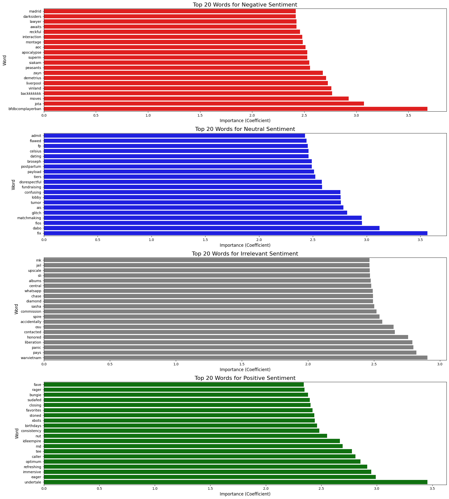

🌀 VIBE-LENZZ

Customer Sentiment Analysis at Scale

 

"Turn raw customer feedback into actionable business insights."

📖 Overview

VIBE-LENZZ is a machine learning-powered application designed to analyze customer sentiments from textual feedback. It empowers organizations to classify comments, identify pain points, and make data-driven decisions to improve products and services.

📉 Problem Statement

In the digital economy, a company’s financial health—spanning profits, sales, and market share—is inextricably linked to its online reputation. Public perception acts as a primary filter for potential customers.

The reliance on this feedback loop creates a critical vulnerability: if negative sentiment outweighs the positive, companies face significant revenue loss, rapid customer churn, and long-term damage to brand reputation.

VIBE-LENZZ addresses this by analyzing feedback at scale, moving beyond simple observation to data-driven action.

🚀 Motivation: The Cost of Ignoring Sentiment

Real-world examples illustrate the severe financial risks of failing to analyze customer feedback effectively.

🎮 Case Study 1: The Last of Us Part II (Naughty Dog)

Challenge

Failure

Impact

"Review Bombing" driven by ideological polarization.

Lacking nuanced tracking, they failed to segment valid criticism from trolling.

Long-term sales potential was damaged due to an uncontrolled negative narrative.

✨ The VIBE-LENZZ Solution: Real-time dashboards would have identified specific grievance themes immediately for a strategic PR response.

👗 Case Study 2: Fashion Nova

Challenge

Failure

Impact

$4.2 million FTC fine for suppressing negative reviews.

Hid comments under 4 stars, blinding them to sizing/quality issues.

Loss of consumer trust and massive financial penalties.

✨ The VIBE-LENZZ Solution: Automated analysis would have highlighted product flaws (e.g., sizing issues) for immediate improvement rather than hiding them.

⚙️ How It Works

graph TD
    A[📂 User Upload] -->|CSV or PDF| B(🧹 Data Preprocessing)
    B --> C{⚙️ Feature Engineering}
    
    subgraph Pipeline
    B -->|Clean & Tokenize| B1[Remove Noise/Stopwords]
    B1 -->|Normalize| B2[Lemmatization]
    B2 --> C
    end

    C -->|TF-IDF Vectorization| D[🤖 Model Prediction]
    
    subgraph Model
    D -->|Input Features| E[Linear SVM Classifier]
    E -->|Classify| F[Sentiment Output]
    end

    F --> G[📊 Streamlit Dashboard]
    
    subgraph Insights
    G --> H[📈 Visualizations]
    G --> I[📑 PDF Report]
    end
    
    H -->|Pie & Bar Charts| J[User Insights]
    I -->|Downloadable| J

    style A fill:#f9f,stroke:#333,stroke-width:2px
    style E fill:#bbf,stroke:#333,stroke-width:2px
    style G fill:#dfd,stroke:#333,stroke-width:2px

📥 Input: Upload CSV (with a Text column) or PDF files containing raw comments.

🧹 Preprocessing: Auto-cleaning of noise (URLs, emojis, stopwords) and normalization.

🧮 Vectorization: TF-IDF transforms text, weighing impactful words to capture sentiment drivers.

🤖 Prediction: An SVM model classifies sentiment (Positive/Negative/Neutral).

📊 Visualization: The app generates charts and a downloadable PDF report.

🗣️ Linguistic Insights: Top Words by Sentiment

Beyond simple classification, VIBE-LENZZ extracts the key drivers behind customer opinions. By analyzing word frequency, we identified distinct vocabulary patterns that characterize each sentiment.

<em>(Fig: Most frequent terms driving Positive vs. Negative sentiment)</em>

🔑 Key Findings

🟢 Positive Drivers: Words like "Love", "Best", and "Great" dominate. These often correlate with user satisfaction and brand loyalty.

🔴 Negative Drivers: Complaints often center around specific failures, featuring words like "Crash", "Slow", or "Refund". This highlights that technical/service stability is the primary cause of churn.

🔵 Neutral Signals: Functional terms like "Update" or "Release" appear frequently, often indicating informational queries rather than emotional feedback.

💡 Business Value: This granular analysis allows companies to stop guessing why users are unhappy and fix the specific root causes.

📊 Model Performance & Error Analysis

To ensure reliability, we benchmarked three algorithms: Naive Bayes, Logistic Regression, and Linear SVM.

1. Model Comparison

We utilized Confusion Matrices to visualize decision boundaries:

Naive Bayes

Linear SVM (Selected)

Logistic Regression

🏆 Why Linear SVM Won:

Naive Bayes struggled, misclassifying 'Neutral' data as 'Negative'.

Linear SVM provided the most balanced accuracy, correctly identifying 2,877 Neutral cases (the hardest class).

2. Deep Dive: The "Neutrality" Challenge

Despite SVM's strong performance, the model occasionally confuses Neutral comments with Positive or Negative ones.

The "Vocabulary Overlap" Problem:
Our error analysis reveals that "Neutral" comments often share high-frequency nouns and verbs with polarized comments but lack defining adjectives.

Evidence: As seen above, words like "game", "time", and "just" appear massively across all three sentiments.

The Dilemma: Because these words lack inherent polarity, the model struggles to distinguish a neutral statement ("I played the game") from a negative one ("This game is broken") based purely on frequency.

Conclusion: Future iterations will implement Contextual Embeddings (BERT) to solve this ambiguity.

📂 Data Requirements

To ensure the model performs correctly, please ensure your data meets the following criteria:

CSV Files: Must contain a column explicitly named Text.

PDF Files: Can contain multiple pages; the system will automatically extract all text.

🔧 Installation & Usage

To run this project locally:

Clone the repository:

git clone [https://github.com/your-username/vibe-lenzz.git](https://github.com/your-username/vibe-lenzz.git)
cd vibe-lenzz

Install dependencies:

pip install -r requirements.txt

Run the application:

streamlit run app.py
